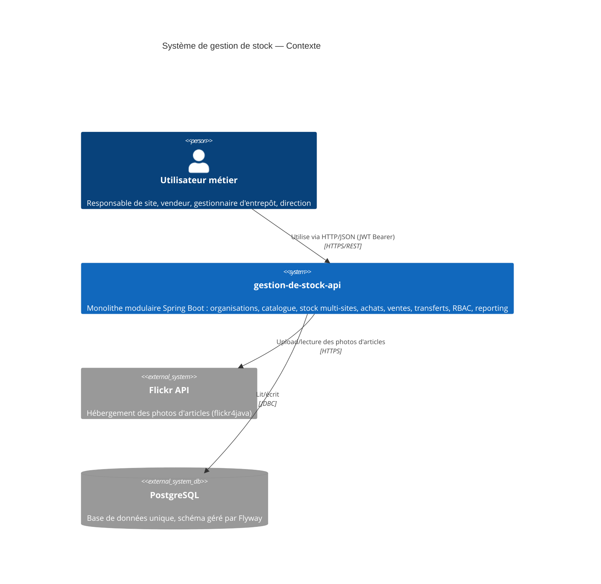
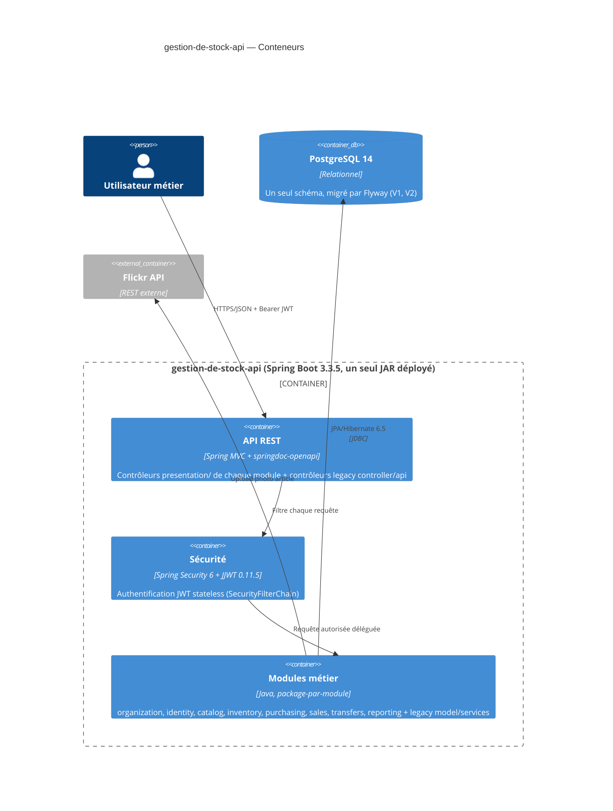
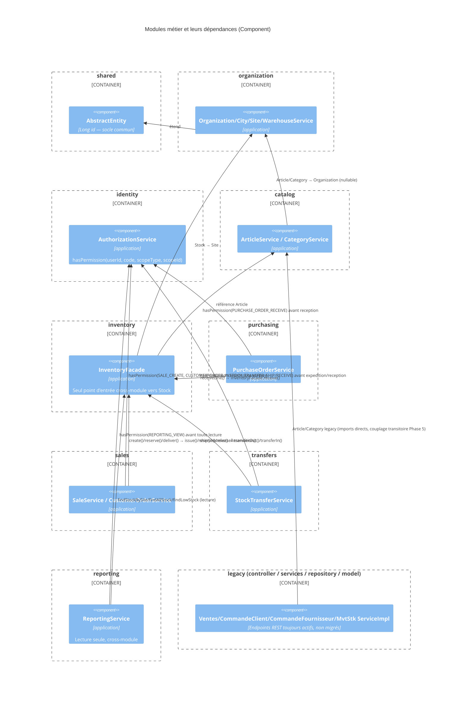
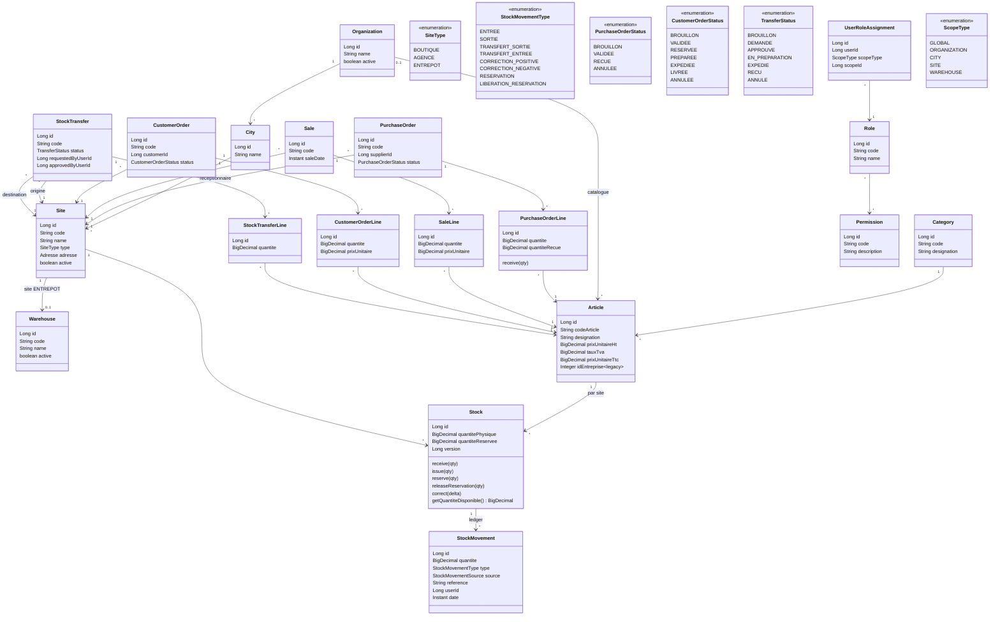
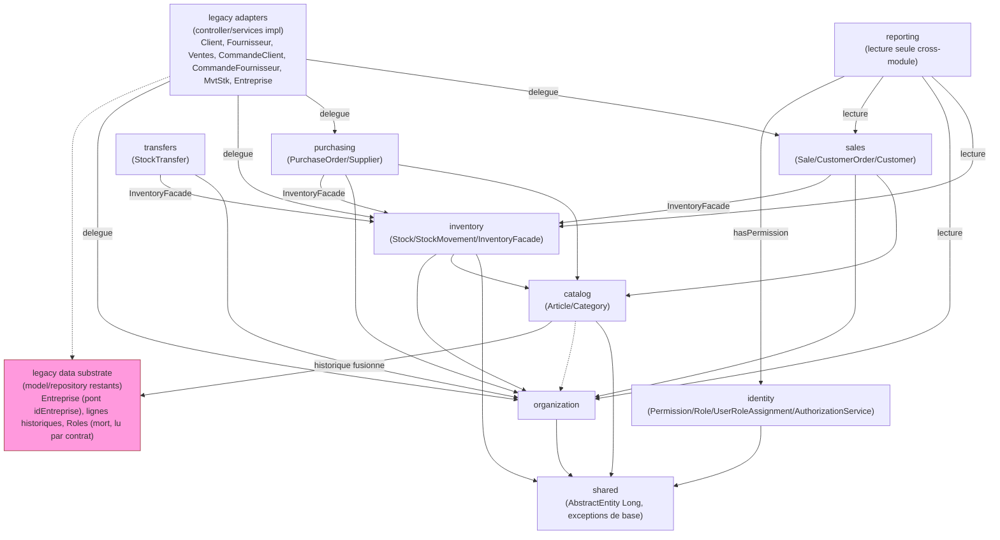
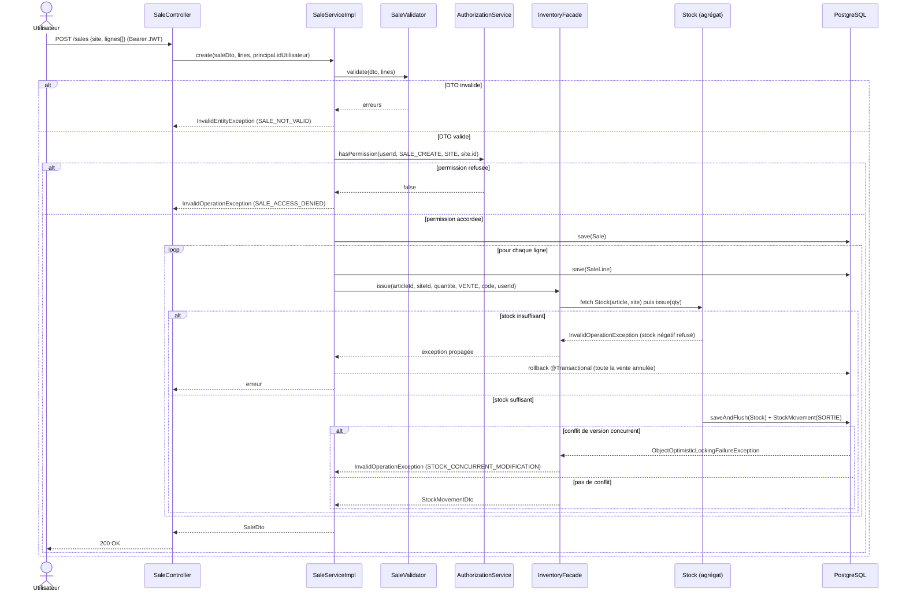
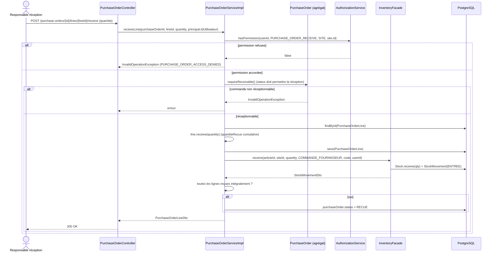
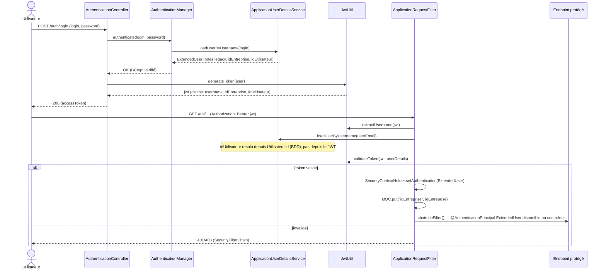
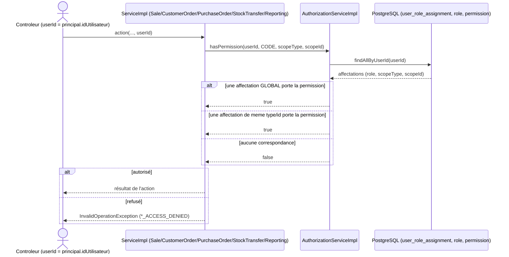

# Architecture — gestion-de-stock-api

Documentation d'architecture (Livrable 13 du prompt maître, section 46). Diagrammes C4
(System Context / Container / Component) et diagrammes UML (classes métier, architecture des
modules, séquences vente / réception fournisseur / transfert / authentification), en Mermaid.

Cette documentation décrit l'état **réel** du code après les 13 phases de migration (voir
`tender-crafting-lark.md` pour le détail phase par phase), y compris ce qui reste
intentionnellement legacy ou non branché — pas une cible aspirationnelle.

---

## 1. C4 — Niveau 1 : System Context

---

## 2. C4 — Niveau 2 : Container

Un seul déploiement (monolithe modulaire) — pas de microservices (interdit section 62).

---

## 3. C4 — Niveau 3 : Component (intérieur du conteneur applicatif)

Chaque module métier suit la structure interne `domain / application / infrastructure /
presentation`. Règle de frontière stricte : **aucun module n'importe le repository ou l'entité
JPA d'un autre module** — seule une interface `application.*Facade` (ou `*Service` pour
`reporting`, en lecture seule) est visible depuis l'extérieur du module.

**Écart comblé en Phase 14** : `identity.AuthorizationService` est désormais consommé par les 4
services d'écriture en plus de `reporting` (`SaleService.create`, `CustomerOrderService.reserve/
deliver/cancel`, `PurchaseOrderService.receiveLine`, `StockTransferService.ship/receive`), avec
un `userId` réel résolu depuis le principal Spring Security (`ExtendedUser.idUtilisateur`, voir
§9). Écart restant, volontairement hors de cette phase : `UserRoleAssignmentController` (et
`RoleController`/`PermissionController`) — l'administration du RBAC lui-même — ne vérifie encore
aucune permission avant d'accorder un rôle (voir §10).

---

## 4. UML — Classes métier

---

## 5. UML — Architecture des modules (dépendances autorisées)

**Mise à jour Phase 16-23** : le nœud `legacy` n'est plus un système parallèle non raccordé —
`controller/`+`services/impl/` (Client, Fournisseur, Ventes, CommandeClient, CommandeFournisseur,
MvtStk) sont désormais de purs adaptateurs HTTP qui **délèguent** aux modules `sales`/`purchasing`/
`inventory`/`organization` (voir §11). Ce qui reste dans `model/`/`repository/` n'est plus
qu'un **substrat de données** conservé pour deux raisons concrètes, pas par défaut de travail :
(1) `Entreprise`/`EntrepriseRepository` est le pont actif `idEntreprise → organizationId` que ces
cinq adaptateurs résolvent à chaque requête (le supprimer casserait les cinq d'un coup) ; (2)
`LigneVente`/`LigneCommandeClient`/`LigneCommandeFournisseur` (+ leurs parents `Ventes`/
`CommandeClient`/`CommandeFournisseur`/`Client`/`Fournisseur` requis par le type JPA) sont encore
lus par `catalog.ArticleServiceImpl` (historique par article + garde-fou de suppression), fusionnés
avec les nouvelles tables `sale_line`/`customer_order_line`/`purchase_order_line` pour ne pas
perdre l'historique pré-migration. `Roles`/`RolesRepository`/`RolesDto` restent aussi (plus aucun
écrivain depuis la Phase 17) car `UtilisateurDto.roles` fait encore partie du contrat JSON de
`/utilisateurs/*`. Les 7 repositories vraiment morts (`ClientRepository`, `FournisseurRepository`,
`VentesRepository`, `CommandeClientRepository`, `CommandeFournisseurRepository`, `MvtStkRepository`,
`RolesRepository` — zéro consommateur confirmé par grep) ont été supprimés.

Légende : trait plein = dépendance de construction du modèle (référence de domaine ou appel de
facade) ; trait pointillé = couplage transitoire toléré (`catalog → organization` est une FK
nullable en cours d'adoption ; `legacyAdapters → legacyData` est la résolution `idEntreprise` et
l'écriture legacy résiduelle). `legacyData` (rose) est le seul nœud encore non éliminable — voir
§11 pour la justification détaillée classe par classe.

---

## 6. Séquence — Vente comptant (module `sales`, `Sale`)

Flux réellement implémenté aujourd'hui, y compris la vérification de permission/scope de la
section 47 du prompt maître, branchée en Phase 14.

**Refus multi-site (section 48)** : si le stock local du site vendeur est insuffisant, la vente
est refusée — **aucun basculement automatique** vers un autre site n'est tenté (décision actée,
Livrable 2 du plan de migration). Un responsable doit créer un transfert manuel (§8).

---

## 7. Séquence — Réception fournisseur (module `purchasing`)

Corrige le défaut du flux legacy : l'entrée de stock est déclenchée par une réception explicite,
pas par le changement d'état de la commande.

**Note (Livrable 1/7)** : l'ancien flux (`CommandeFournisseurServiceImpl`, module legacy)
entrait du stock à **chaque sauvegarde** de la commande puis une **deuxième fois** au passage à
`LIVREE` — double comptage confirmé par lecture du code. Non corrigé dans le legacy (isolation
du risque, Livrable 2), corrigé par construction dans `purchasing` : seul `receiveLine` appelle
`InventoryFacade`.

---

## 8. Séquence — Transfert inter-sites (module `transfers`)

Deux mouvements de stock atomiques individuellement (un par site), pas une seule transaction
globale — le transport prend du temps dans la vraie vie (section 12).

```mermaid
sequenceDiagram
    actor R as Demandeur
    actor A as Approbateur
    participant TC as StockTransferController
    participant TS as StockTransferServiceImpl
    participant TR as StockTransfer (agrégat)
    participant AZ as AuthorizationService
    participant IF as InventoryFacade
    participant DB as PostgreSQL

    R->>TC: POST /transfers {origine, destination, lignes[]}
    TC->>TS: create(dto, lines)
    TS->>TR: valider origine != destination
    TS->>DB: save(BROUILLON)
    R->>TC: POST /transfers/{id}/submit
    TC->>TS: submit(id) → DEMANDE
    A->>TC: POST /transfers/{id}/approve
    TC->>TS: approve(id, approverUserId) → APPROUVE
    TC->>TS: startPreparation(id) → EN_PREPARATION

    Note over TS,IF: Expédition — sortie réelle du site origine
    R->>TC: POST /transfers/{id}/ship
    TC->>TS: ship(id, principal.idUtilisateur)
    TS->>AZ: hasPermission(userId, STOCK_TRANSFER_SHIP, SITE, origine.id)
    alt permission refusee
        AZ-->>TS: false
        TS-->>TC: InvalidOperationException (STOCK_TRANSFER_ACCESS_DENIED)
    else permission accordee
    TS->>TR: requireShippable()
    loop pour chaque ligne
        TS->>IF: transferOut(articleId, origineId, quantite, code, userId)
        IF->>DB: Stock(origine).issue(qty) + StockMovement(TRANSFERT_SORTIE)
        alt stock origine insuffisant
            IF-->>TS: InvalidOperationException
        end
    end
    TS->>DB: status = EXPEDIE
    end

    Note over TS,IF: Réception — entrée réelle sur le site destination
    R->>TC: POST /transfers/{id}/receive
    TC->>TS: receive(id, principal.idUtilisateur)
    TS->>AZ: hasPermission(userId, STOCK_TRANSFER_RECEIVE, SITE, destination.id)
    alt permission refusee
        AZ-->>TS: false
        TS-->>TC: InvalidOperationException (STOCK_TRANSFER_ACCESS_DENIED)
    else permission accordee
    TS->>TR: requireReceivable()
    loop pour chaque ligne
        TS->>IF: transferIn(articleId, destinationId, quantite, code, userId)
        IF->>DB: Stock(destination).receive(qty) + StockMovement(TRANSFERT_ENTREE)
    end
    TS->>DB: status = RECU
    end
    TS-->>TC: StockTransferDto
```

Garde-fous vérifiés par tests : origine = destination refusé à la création ; expédition avant
`EN_PREPARATION` refusée ; expédition dépassant le stock d'origine refusée (verrouillage
optimiste + invariant `Stock`) ; annulation après expédition refusée (le stock est déjà en
transit, annuler laisserait la marchandise nulle part) ; permission `STOCK_TRANSFER_SHIP`/
`STOCK_TRANSFER_RECEIVE` vérifiée sur le site origine/destination respectivement (Phase 14).

---

## 9. Séquence — Authentification / Autorisation

**Branché en Phase 14** : l'authentification legacy (9a) résout désormais un `idUtilisateur: Long`
réel (en plus de l'`idEntreprise` legacy), porté par le principal Spring Security et le JWT ; ce
`userId` est ce que les contrôleurs des modules neufs transmettent à `AuthorizationService` (9b),
consommé aujourd'hui par `reporting` **et** par les 4 services d'écriture (`Sale`, `CustomerOrder`,
`PurchaseOrder`, `StockTransfer` — voir §6, §7, §8). Il n'existe toujours qu'un seul flux
d'authentification (9a) ; ce que Phase 14 a changé, c'est qu'il alimente maintenant 9b au lieu
d'être un système parallèle non consommé.

### 9a. Authentification JWT (`services/auth`, `config/SecurityConfiguration`)

### 9b. Autorisation par permission/scope (consommé par `reporting` et les 4 services d'écriture)

**Amorçage (bootstrap)** : la toute première affectation RBAC d'une organisation est créée par
`EntrepriseServiceImpl.save()` lui-même (rôle `ADMINISTRATEUR`, scope GLOBAL, pour l'admin créé
en même temps que l'`Entreprise`) — c'est un appel serveur interne, pas une requête HTTP passée
par 9a/9b, donc il ne dépend d'aucune permission préexistante (voir §10 pour la limite que cela
implique sur `UserRoleAssignmentController`).

---

## 10. Récapitulatif des écarts assumés (traçabilité)

| Écart | Où | Pourquoi différé |
|---|---|---|
| ~~Legacy Ventes/CommandeClient/CommandeFournisseur/MvtStk actifs en parallèle~~ **Comblé en Phase 16-22** | §5, §11 | Les 6 contrôleurs legacy (Client/Fournisseur/Ventes/CommandeClient/CommandeFournisseur/MvtStk) sont maintenant des adaptateurs qui délèguent aux modules sales/purchasing/inventory/organization ; permission `SALE_CREATE`/`PURCHASE_ORDER_RECEIVE`/etc. désormais vérifiée sur ces chemins via les services neufs |
| `idEntreprise` non supprimé sur Article/CommandeClient/Ventes/MvtStk | §4 (`Integer idEntreprise~legacy~`) | Encore résolu vers `organizationId` par les adaptateurs Phase 16-22 (§11) — colonne conservée, plus jamais la seule source de vérité |
| Pas de hiérarchie de scope (CITY→SITE) dans `AuthorizationService` | §9b | Aucun cas d'usage réel ne l'exige encore (Phase 4/10) |
| Pas de backfill RBAC pour des utilisateurs legacy existants | §9b | Audit Phase 14 : `utilisateur`/`roles` à 0 ligne en base de dev — aucune inscription legacy réelle n'a jamais eu lieu, rien à migrer ; le bootstrap ne couvre que les nouvelles inscriptions |

**Comblé en Phase 15** : `UserRoleAssignmentController`/`RoleController`/`PermissionController`
exigent désormais `RBAC_MANAGE` (scope GLOBAL) sur `save`/`delete` (`V4__seed_rbac_manage_permission.sql`,
ajouté au rôle `ADMINISTRATEUR`). Le bootstrap interne (`EntrepriseServiceImpl`) reste un appel de
service direct, non soumis à ce gate. Voir le plan de migration (Phase 15) pour la liste complète
des 11 bugs trouvés et corrigés lors de l'audit exhaustif en conditions réelles qui a accompagné
ce travail (aucun n'était détectable par `@SpringBootTest` appelant les services Java directement
— d'où l'ajout de 23 tests HTTP réels via MockMvc, `mvn clean test` : 65/65).

Ce tableau est le pendant documentaire des décisions déjà actées dans
`~/.claude/plans/tender-crafting-lark.md` (Livrable 2 et journal de phases) — il ne les
duplique pas en détail, il les rend visibles depuis la documentation d'architecture comme
l'exige la section 46 du prompt maître.

---

## 11. Phases 16-23 — Décommissionnement du legacy (adaptateurs, pas suppression totale)

Plan détaillé : `~/.claude/plans/reflective-conjuring-horizon.md`. Objectif de départ : éliminer
toute duplication d'organisation entre le legacy plat (`model/services/controller/repository`) et
les modules neufs. Résultat réel, vérifié par lecture du code avant d'écrire cette section (pas
aspirationnel) : **la duplication de logique métier est éliminée**, mais la suppression physique
totale des fichiers/tables legacy s'est révélée **non sûre** pour deux raisons concrètes
découvertes en cours de route (détaillées ci-dessous) — le tableau final reflète ce qui a
réellement été fait, y compris ce qui a été délibérément conservé et pourquoi.

### Phase 16 — Fondations
`sales.Customer` et `purchasing.Supplier` créés (n'existaient nulle part avant). Champs de
contact (`email/phone/website/taxCode/photo/adresse`) ajoutés à `organization.Organization`. Site
implicite (`OrganizationService.ensureDefaultSite`) pour les écritures legacy qui n'ont aucune
notion de site. `EntrepriseServiceImpl.save()` crée désormais aussi une `Organization` miroir +
site par défaut, et stocke `Entreprise.organizationId` — **ce champ est le pont que toutes les
phases suivantes résolvent** (voir Phase 23).

### Phase 17 — Cutover RBAC
`ApplicationUserDetailsService` source les `GrantedAuthority` depuis `identity.UserRoleAssignment`
au lieu du `Roles` legacy (qui n'a plus aucun écrivain depuis cette phase). Plus petit que prévu :
aucune fonctionnalité ne consommait déjà `hasRole`/`@PreAuthorize` (vérifié, 0 résultat), ces
authorities étaient déjà décoratives.

### Phases 18-22 — Adaptateurs (contrat HTTP inchangé, implémentation re-backée)
`Client→Customer`, `Fournisseur→Supplier`, `Ventes→Sale`, `CommandeClient→CustomerOrder`,
`CommandeFournisseur→PurchaseOrder`, `MvtStk→Stock/StockMovement`. Chaque contrôleur legacy garde
son URL et la forme JSON de son DTO ; l'implémentation du service ne touche plus les tables
legacy, elle délègue au module correspondant. Changements de comportement assumés et vérifiés par
test (aucun test existant cassé, 74/74 verts à chaque phase) :
- Une vente/commande sans ligne est refusée (invariant du module neuf, absent du legacy).
- `DELETE /ventes/delete/{id}` et `DELETE /commandesclients|fournisseurs.../delete/{id}` renvoient
  desormais 400 (`*_DELETE_NOT_SUPPORTED`) au lieu de supprimer.
- Les 4 PATCH de mutation libre (`update/quantite`, `update/client`, `update/article`,
  `delete/article`) sur CommandeClient/CommandeFournisseur renvoient 400
  (`*_MUTATION_UNSUPPORTED`) — la machine à états gardée du module neuf n'a pas d'équivalent
  "patch de champ arbitraire". `update/etat` reste fonctionnel pour les transitions légales
  (mappées vers `validate()`/`deliver()`/reception complète des lignes).
- Le bug de double comptage de stock de `CommandeFournisseurServiceImpl` (entrée à `save()` **et**
  à `updateEtatCommande(LIVREE)`, Livrable 1 #4 / Phase 7) disparaît naturellement : seul
  `PurchaseOrderService.receiveLine` touche le stock désormais. Vérifié en conditions réelles
  (`mvn spring-boot:run` + curl) : 100 reçu → 2 vendu → 3 reçu = 101, pas 104.
- Effet de bord découvert et corrigé en cours de Phase 23 (pas anticipé au moment d'écrire le
  plan) : `catalog.ArticleServiceImpl` (Phase 5) lisait l'historique par article et son garde-fou
  de suppression **uniquement** depuis les tables legacy `lignevente`/`lignecommandeclient`/
  `lignecommandefournisseur`. Comme les Phases 19-21 écrivent désormais dans les tables neuves
  (`sale_line`/`customer_order_line`/`purchase_order_line`), laisser `ArticleServiceImpl` tel quel
  aurait silencieusement rendu l'historique incomplet et le garde-fou de suppression inefficace
  pour toute donnée post-migration. Corrigé : les deux sources sont désormais fusionnées.

### Phase 23 — Nettoyage : ce qui a été supprimé, ce qui ne pouvait pas l'être

**Supprimé** (vérifié 0 référence dans tout `src/`, y compris les tests, avant suppression) : les
7 repositories devenus des coquilles vides — `ClientRepository`, `FournisseurRepository`,
`VentesRepository`, `CommandeClientRepository`, `CommandeFournisseurRepository`,
`MvtStkRepository`, `RolesRepository`.

**Non supprimé, avec justification technique vérifiée (pas par précaution générique)** :

| Élément | Pourquoi il doit rester |
|---|---|
| `Entreprise` (entité + table) | Pont actif `idEntreprise → organizationId` : les 6 adaptateurs des Phases 18-22 le résolvent à **chaque requête**. Le supprimer casse les 6 simultanément. Le fusionner réellement dans `Organization` demanderait de refaire cette résolution dans les 6 adaptateurs avec un nouveau mécanisme — hors périmètre d'un nettoyage, c'est une nouvelle phase de conception à part entière. |
| `Client`, `Fournisseur`, `CommandeClient`, `CommandeFournisseur`, `Ventes`, `LigneVente`, `LigneCommandeClient`, `LigneCommandeFournisseur` (entités) | `catalog.ArticleServiceImpl` lit encore les 3 tables de lignes pour préserver l'historique **pré-migration** (voir Phase 18-22 ci-dessus) ; leurs entités parentes (`CommandeClient`, `CommandeFournisseur`, `Ventes`) et grand-parentes (`Client`, `Fournisseur`) doivent rester compilables car les entités de ligne les référencent par type JPA (`@ManyToOne`). Supprimer une table sans supprimer le mapping Hibernate correspondant casserait `ddl-auto=validate` au démarrage. |
| `Roles`, `RolesRepository`, `RolesDto` | Aucun écrivain depuis la Phase 17, mais `UtilisateurDto.roles` fait encore partie du contrat JSON de `/utilisateurs/*` (le supprimer changerait la forme de la réponse). |
| `EtatCommande`, `TypeMvtStk`, `SourceMvtStk` | Toujours les types exacts du contrat JSON/URL legacy (`EtatCommande` est le type du `@PathVariable` de `update/etat/{etat}` ; `TypeMvtStk`/`SourceMvtStk` sont des champs de `MvtStkDto`). Les adaptateurs Phase 19-22 les traduisent vers/depuis les enums neufs, ils ne les remplacent pas. |
| `VentesDto`, `CommandeClientDto`, `CommandeFournisseurDto`, `ClientDto`, `FournisseurDto`, `MvtStkDto`, `LigneVenteDto`, `LigneCommandeClientDto`, `LigneCommandeFournisseurDto` | Ce sont le contrat JSON legacy lui-même, construit directement par les adaptateurs (plus via `fromEntity`/`toEntity` sur les entités legacy, mais les classes DTO restent la forme de réponse HTTP). |

**Conclusion** : l'objectif "plus de duplication d'organisation" est atteint pour la **logique
métier** (un seul chemin d'écriture par domaine, dans les modules neufs) — pas pour les **données
historiques**, dont la suppression est un choix produit distinct (archiver ? migrer ? purger ?)
qu'aucune instruction de cette session n'habilitait à trancher unilatéralement, conformément à la
règle absolue du prompt maître (section 3) : ne jamais supprimer sans justification, et vérifier
les usages avant toute suppression plutôt que supposer qu'une suppression est sûre.

### Validation

`mvn clean test` : 74/74 verts à l'issue de chaque phase (65 hérités des Phases 1-15 + 9 nouveaux
en Phase 16). Audit `mvn spring-boot:run` + curl en conditions réelles sur les 6 chaînes legacy
migrées (entreprise → login → catégorie/article → client/fournisseur → mvtstk → ventes →
commandeclient → commandefournisseur), incluant la vérification numérique du stock après vente +
réception pour confirmer l'absence de double comptage.
